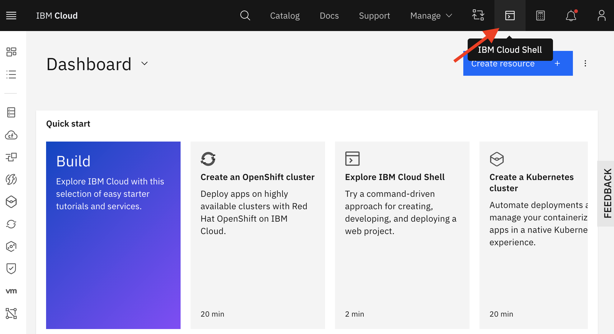

# How to use IBM Cloud shell

I discuss using IBM Cloud shell [in this webinar](https://ibm.box.com/s/aywqiv6b6xkdvp46t889onw12o4ul145) (log in into Box with your IBM account first).

The advantages of using IBM Cloud Shell:

- You can choose to run the Shell in the specific region in which you have set up your cluster.
- The IBM Cloud CLI is already installed, and you are logged in when you open the shell.
- The necessary Openshift CLI (`oc`) and Kubernetes CLI (`kubectl`) are already installed, you will just need to log in with a temp bearer token.

The **dis**advantages of using IBM Cloud shell: 

- Your environment is recycled after an hour of inactivity, so you will need to upload/install the `cpd-cli` and set your entitlement key each time after the environment is recycled.
- Long running scripts are killed.
- You can use the IBM Cloud Shell for maximum 50 hours per week.

Starting the shell is easy: goto https://cloud.ibm.com and click the start shell button in the top menu:

This is the IBM Cloud Shell welcome:

Notice that you can upload/download stuff from/to your pc to/from the shell. 

