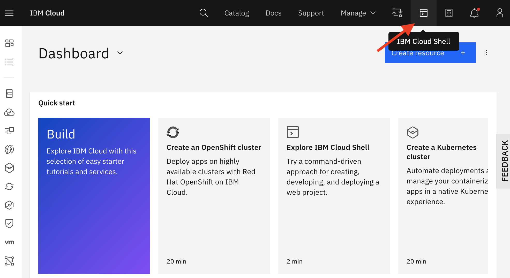
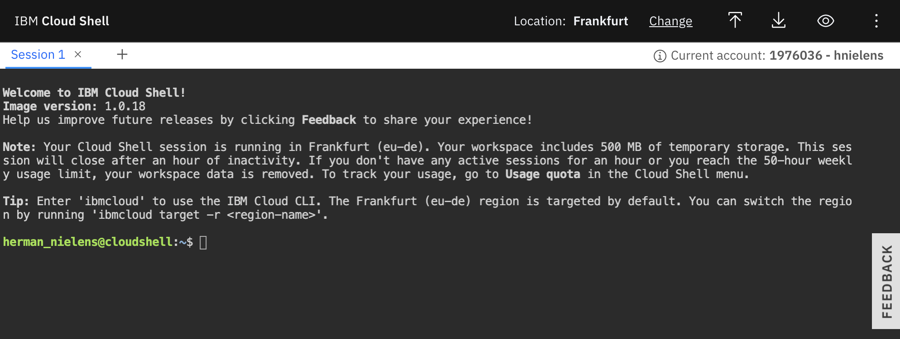

# How to use cpd-cli to install/patch/upgrade CPD services on ROKS

- [Make sure you have gathered the necessary info before you begin](#make-sure-you-have-gathered-the-necessary-info-before-you-begin)
- [Choose a "computer" to install from (aka a bastion node)](#choose-a-computer-to-install-from-aka-a-bastion-node)
- [Declare some variables for later use](#declare-some-variables-for-later-use)
- [Log in into your cluster](#log-in-into-your-cluster)
- [Download, install and configure cpd-cli](#download-install-and-configure-cpd-cli)
- [Installing, patching and upgrading new services](#installing-patching-and-upgrading-new-services)

## Make sure you have gathered the necessary info before you begin
You will need the following stuff, so make sure you collect it upfront, so you can copy/paste it quickly when and where you need it further down the line:

- Your entitlement key for IBM container software. This is located in your My IBM profile: https://myibm.ibm.com/products-services/containerlibrary
- Your cluster's ingress subdomain name. You can copy this from your cluster details in IBM Cloud: https://cloud.ibm.com/kubernetes/clusters.
- The name of your CPD project/namespace, e.g. `zen`.
- The apikey of your CPD instance, you can find that in the profile of your CPD administrator account.
- The name of the storageclass you choose when you installed CPD using the IBM Cloud installer (for endurance type storage the storage class is called `ibmc-file-gold-gid`).

## Choose a "computer" to install from (aka a bastion node)
Although it is possible to install from Mac I would advise installing from a linux machine. Moreover, the closer that linux machine is to your cluster the better because... the `cpd-cli` will download and transfer the necessary software images for the services you are going to install/update/patch.

So... unless you can go and sit in the data center and plug in your Mac in the network, you will need an alternative. You can either provision/reuse a linux VM in the same IBM Cloud data center/region or choose the quick and dirty way: use IBM Cloud Shell.

IBM Cloud Shell is an in-browser shell that you can quickly start from the https://cloud.ibm.com homepage.

The advantages of using IBM Cloud Shell:

- You can choose to run the Shell in the specific region in which you have set up your cluster.
- The IBM Cloud CLI is already installed, and you are logged in when you open the shell.
- The necessary Openshift CLI (`oc`) and Kubernetes CLI (`kubectl`) are already installed, you will just need to log in with a temp bearer token.

The **dis**advantages of using IBM Cloud shell:

- Your environment is recycled after an hour of inactivity, so you will need to upload/install the `cpd-cli` and set your entitlement key each time after the environment is recycled.
- You can use the IBM Cloud Shell for maximum 50 hours per week.

To keep things simple and to avoid having to install `oc` and `kubectl` we assume here that you will use the IBM Cloud Shell.

Starting the shell is easy: goto https://cloud.ibm.com and click the start shell button in the top menu:



This is the IBM Cloud Shell welcome:



Notice that you can upload/download stuff from/to your pc to/from the shell. We will do that in a minute.<br>


## Declare some variables for later use
Let's declare some variable=value pairs with some of the stuff you collected in the beginning to make things easier further along the line (the variables are used in further code snippets):

```
export namespace={{your_cpd_namespace}}
export storageclass={{your_storage_class}}
export myclusterdomain={{your_cluster_domain_name_here}}
export mycpdurl={{your_cpd_url}}
export apikey={{your_api_key_here}}
```

## Log in into your cluster
You can copy the oc CLI command for logging in into your cluster from your cluster's openshift web gui.


Run the login command in the shell:
```
oc login --token={{your_bearer_token}} --server={{your_server_naem}}
```
You can set your namespace/project as the default namespace/project to test you are whether you are successfully logged in into your cluster:
```
oc project $namespace # The $-sign indicates that we reference the vars we declared earlier
```

## Download, install and configure cpd-cli

### Download the tarball to your pc

Download the `cpd-cli` installer to your PC. As we are working in the IBM Cloud Shell you will need the latest `cpd-cli` enterprise edition version for linux. If the latest version is 3.5.3 then you download `cpd-cli-linux-EE-3.5.3.tgz`.

**Note**
Make sure to keep a copy of this tarball on your PC, as you will probably need to install it more than once. Remember: IBM Cloud Shell will reset after 60 minutes of inactivity.

### Upload the tarball to your shell
Upload the tarball to your IBM Cloud Shell environment using the upload button:</br>


### Extract the tarball
Extract the contents of the tarball, you have uploaded to the Cloud Shell environment:
```
tar -zxvf cpd-cli-linux-EE-{{cpd-cli_version}}
```
### Edit and save the repo.yaml
We need to add our license entitlement key to the `repo.yaml` file we just extracted:
```
---
fileservers:
  -
    url: "https://raw.github.com/IBM/cloud-pak/master/repo/cpd/3.5"
registry:
  -
    url: cp.icr.io/cp/cpd
    name: base-registry
    namespace: ""
    username: cp
    apikey: <entitlement key>
```
As we will have to do this every time our shell session idles out, you might want to download the `repo.yaml` file to your PC (use the button), add the entitlement key and save a copy for upload when needed.

Upload the `repo.yaml` file from your PC to the shell environment (use the button).

This section discusses `cpd-cli` and `repo.yaml` in the documentation for CPD v3.5: https://www.ibm.com/docs/en/cloud-paks/cp-data/3.5.0?topic=tasks-obtaining-installation-files

### Create and save a cpd-cli profile
Finally, create a `cpd-cli` profile (needed for some actions only). This is also described in detail in the documentation:
https://www.ibm.com/docs/en/cloud-paks/cp-data/3.5.0?topic=installing-creating-cpd-cli-profile

```
./cpd-cli config users set cpd-admin-user --username admin --apikey $apikey
# Note that we use the $apikey value here

./cpd-cli config profiles set cpd-admin-profile --user cpd-admin-user --url $mycpdurl
# Note that we use the $mycpdurl here
```

## Installing, patching and upgrading new services

Take some time to read about the general process of installing, upgrading and patching the CPD control plane and services in the documentation:

Installing, upgrading and patching involve a little dance that is the same for each service

- Prepare the cluster to install the service? Be attentive to specific requirments for databases from the Db2 family.
- Install the service
- Check for patches
- Set up instances if applicable

Let's install the Datastage Enterprise Plus service. Note that the code snippets below can be used for any service thanks to the variables we declared in the beginning.

The documentation describes the process for Datstage Enterprise Plus (and for the other services) in detail: https://www.ibm.com/docs/en/cloud-paks/cp-data/3.5.0?topic=plus-setting-up-cluster-datastage-enterprise

### Prepare

First declare the service you want to install. The service name is mentioned in the installation documentation for the specific service. For Datastage Enterprise Plus the service name is `ds`.

```
export assembly=ds
```

**Note**
A client can choose to buy Datastage Enterprise or Datastage Enterprise Plus. The service name for Datastage Enterprise is `ds-ent`. The service name for Datastage Enterprise Plus is `ds`.

Run the script that will prepare the cluster by doing some checks and adding stuff like new roles:

```
# Note that we use the $assembly and $namespace values here

./cpd-cli adm \
--repo ./repo.yaml \
--assembly $assembly \
--namespace $namespace \
--latest-dependency \
--accept-all-licenses
```

Check the results. You will see that the script was not really executed but just simulated the execution. You can excute it by adding `--apply`.

```
# Note that we use the $assembly and $namespace values here

./cpd-cli adm \
--repo ./repo.yaml \
--assembly $assembly \
--namespace $namespace \
--latest-dependency \
--accept-all-licenses \
--apply
```

### Install

Now we are ready to install Datastage Enterprise Plus:

```
# Note that we use the $assembly, $namespace, $storageclass and $myclusterdomain values here

./cpd-cli install \
--assembly $assembly \
--namespace $namespace \
--repo ./repo.yaml \
--storageclass $storageclass \
--transfer-image-to=image-registry-openshift-image-registry.$myclusterdomain/zen \
--target-registry-username=$(oc whoami) \
--target-registry-password=$(oc whoami -t) \
--insecure-skip-tls-verify \
--cluster-pull-prefix=image-registry.openshift-image-registry.svc:5000/zen \
--latest-dependency \
--accept-all-licenses \
--dry-run
```

### Patch

TBD
