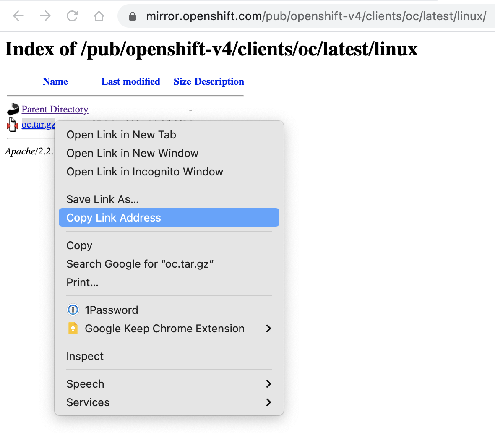

# How to use cpd-cli to install/patch/upgrade CPD services on ROKS

This document discusses how you can install extra services on top of an **existing** Cloud Pak for Data 3.5 deployment that was originally installed using the [IBM Cloud Cloud Pak for Data installer](https://cloud.ibm.com/catalog/content/ibm-cp-datacore-6825cc5d-dbf8-4ba2-ad98-690e6f221701-global). I discuss installing the automated set up and installation of a ROKS cluster with Cloud Pak for Data [in my first webinar](https://ibm.box.com/s/htztaie5zno3lsbenrjgvkfjpgc93e79) in the series about this topic. Make sure you are already logged in into Box with your IBM account for this link to work.

These are the steps you will need to follow:

- [Make sure you have gathered the necessary info before you begin](#make-sure-you-have-gathered-the-necessary-info-before-you-begin)
- [Choose a "computer" to install from (aka a bastion node)](#choose-a-computer-to-install-from-aka-a-bastion-node)
- [Download and install the prerequisite CLIs](#download-and-install-the-prerequisite-clis)
- [Download, install and configure cpd-cli](#download-install-and-configure-cpd-cli)
- [Installing, patching and upgrading new services](#installing-patching-and-upgrading-new-services)

If you need a walkthrough on how to install RedHat Openshift and Cloud Pak for Data completely from scratch, please see this guide (includes automation scripts):
[Install CPD 3.x on Red Hat OpenShift 4.x on VMWare or Bare Metal](https://github.com/IBM-ICP4D/cloud-pak-ocp-4#install-red-hat-openshift-4x-on-vmware-or-bare-metal).

## Make sure you have gathered the necessary info before you begin
You will need the following stuff, so make sure you collect it upfront, so you can copy/paste it quickly when and where you need it further down the line:

- Your entitlement key for IBM container software. This is located in your My IBM profile: https://myibm.ibm.com/products-services/containerlibrary We will need to add this to the repo.yaml as described below in "[Edit and save the repo.yaml](#edit-and-save-the-repoyaml)".
- Your cluster's ingress subdomain name. You can copy this from your cluster details in IBM Cloud: https://cloud.ibm.com/kubernetes/clusters.
- The name of your CPD project/namespace, e.g. `zen`.
- The apikey of your CPD instance, you can find that in the profile of your CPD administrator account.
- The name of the storageclass you choose when you installed CPD using the IBM Cloud installer (for endurance type storage the storage class is called `ibmc-file-gold-gid`).
- The homepage base url of your Cloud Pak for Data instance, e.g. https://zen-cpd-zen.mycluster-ams03-873383-bbeafa5fcc6c15e1c7b1c5daea86b416-0000.ams03.containers.appdomain.cloud/

## Choose a "computer" to install from (aka a bastion node)

We will use `cpd-cli` to prepare, download and transfer the necessary software images for the services you are going to install/update/patch. when you choosing your "bastion node", consider that the closer it is located to your cluster, the smoother your experience will probably be.

### Option 1: Use your PC as a bastion
#### Use your Mac
You can use the default Terminal app (or your preferred terminal, e.g. iTerm) to run `cpd-cli`. Consider the Linux VM alternative ([option 2](https://github.com/hnielens/technotes/blob/main/install_update_cpd_roks_svcs_using_cli.md#option-2-provision-a-linux-vm-or-reuse-an-existing-one)) if you encounter latency or bandwidth issues.

#### Use your Windows 10
Configure and set up your Windows 10 machine for linux to run `cpd-cli`. Consider the Linux VM alternative ([option 2](https://github.com/hnielens/technotes/blob/main/install_update_cpd_roks_svcs_using_cli.md#option-2-provision-a-linux-vm-or-reuse-an-existing-one)) if you encounter latency or bandwidth issues. [Use this walkthrough to set up linux on your Windows 10 machine](https://docs.microsoft.com/en-us/windows/wsl/install-win10).

 ### Option 2: Provision a linux VM (or reuse an existing one)
I discuss how to provision classic infrastructure linux virtual machine [in my third webinar](https://ibm.box.com/s/myo6x4mnr5ab9rtuw5qcgggy3jxak7om) from the series about CPD on ROKS. Make sure you are logged in into Box first.

### Can I use IBM Cloud Shell?
IBM Cloud Shell is an in-browser shell that you can quickly start from the https://cloud.ibm.com homepage.

In [my second webinar](https://ibm.box.com/s/aywqiv6b6xkdvp46t889onw12o4ul145) (log in into Box first) I wrongly assumed that it was possible to use IBM Cloud Shell as a bastion node.

As the IBM Cloud Shell environment will be reset after one hour of inactivity and long running scripts will be killed, IBM Cloud Shell is **not a good** option for using it as a bastion node for installation.

It **is** a good option for simple administrative tasks.

Here is a seperate technote for the ["how-to" for IBM Cloud Shell](how_to_use_ibm_cloud_shell.md#how-to-use-ibm-cloud-shell).

## Download and install the prerequisite CLIs
On your chosen bastion "computer" you will need to one time install following prerequiste CLIs as indicated in the "Access" section in the detail page for your ROKS cluster: https://cloud.ibm.com/kubernetes/clusters.


These are the prerequisite CLIs:

- [The IBM Cloud CLI collection and tools](#install-the-ibm-cloud-cli-collection-and-tools)
- [The RedHat Openshift CLI (oc)](#install-the-redhat-openshift-cli-oc)

I discuss the download and installation of the prerequisite CLIs in [in my third webinar](https://ibm.box.com/s/myo6x4mnr5ab9rtuw5qcgggy3jxak7om) as of time 59:06.

### Install the IBM Cloud CLI collection and tools

Make or choose a folder where you can download stuff and make sure it is your "present working directory".

This command will download and install the IBM Cloud CLI collection and tools:
```
curl -sL https://ibm.biz/idt-installer | bash
```

### Install the Redhat Openshift CLI (oc)
Download the Openshift client that matches the version of your cluster. You can find and copy the download link for the specific version via a browser on your PC by following this link (for OpenShift 4.6): https://mirror.openshift.com/pub/openshift-v4/clients/oc/latest/

On Mac you can just download the tarball using your browser. If you have a linux bastion node, copy the url for "your" `oc.tar.gz` (in Chrome: right-click and choose `copy link address` as shown below).



On linux we can use the popular `wget` command to download the tarball from the link we just copied. Alternatively, you can use cURL if you prefer.
```
wget {{the_link_you_just_copied_for_the_oc}}
```

Untar the tarball, and copy `oc` to /usr/bin/local (see: [The Linux Directory Structure Explained](https://www.howtogeek.com/117435/htg-explains-the-linux-directory-structure-explained/)).

```
tar xvf oc.tar.gz
cp oc /usr/local/bin
```

You will also need the Kubernetes CLI (`kubectl`), but that one already has been installed if you have set up the IBM Cloud CLIs and tools [as described earlier](#install-the-redhat-openshift-cli-oc).

## Download, install and configure cpd-cli
You need to install the cpd-cli on your chosen "bastion node". I discuss this in my second webinar beginning from time 35:47. And I repeat this in [in my third webinar](https://ibm.box.com/s/myo6x4mnr5ab9rtuw5qcgggy3jxak7om) webinar as of time 1:08:30.

### Download the cpd-cli tarball

The cpd-cli releases for CPD 3.5 can be downloaded here: https://github.com/IBM/cpd-cli/releases. We need the EE (Enterprise Editionn version).

If you are on Mac just download the version using your browser (e.g. get `cpd-cli-darwin-EE-3.x.x.tar.gz`, note that the versions for Mac are indictated with `Darwin`).

If your are on Linux copy the download link [as discussed earlier](#install-the-redhat-openshift-cli-oc) for `oc` and use `wget` to download the tarball.

```
wget {{the_link_you_just_copied_for_cpd-cli}}
```

### Extract the tarball
Extract the contents of the tarball.
```
tar xvf cpd-cli-{{linux_or_darwin}}-EE-{{cpd-cli_version}}
```
### Edit and save the repo.yaml
We need to add our license entitlement key to the `repo.yaml` file we just extracted:
```
---
fileservers:
  -
    url: "https://raw.github.com/IBM/cloud-pak/master/repo/cpd/3.5"
registry:
  -
    url: cp.icr.io/cp/cpd
    name: base-registry
    namespace: ""
    username: cp
    apikey: <entitlement key>
```
This section discusses `cpd-cli` and `repo.yaml` in the documentation for CPD v3.5: https://www.ibm.com/docs/en/cloud-paks/cp-data/3.5.0?topic=tasks-obtaining-installation-files

### Create and save a cpd-cli profile
Finally, create a `cpd-cli` profile (needed for some actions only). This is also described in detail in the documentation:
https://www.ibm.com/docs/en/cloud-paks/cp-data/3.5.0?topic=installing-creating-cpd-cli-profile
```
# Note that we use the $apikey value here
./cpd-cli config users set cpd-admin-user --username admin --apikey $apikey

# Note that we use the $mycpdurl here
./cpd-cli config profiles set cpd-admin-profile --user cpd-admin-user --url $mycpdurl
```
## Installing, patching and upgrading new services

Take some time to read about the general process of installing, upgrading and patching the CPD control plane and services in the documentation: https://www.ibm.com/docs/en/cloud-paks/cp-data/3.5.0?topic=installing

**Note**
As this text is for Cloud Pak for Data on ROKS, we follow the steps for a cluster that has Internet connection (not "airgapped").

**Tip**
An installation can take quite some time and you want to avoid problems because of lost connections or your PC going to sleep or loosing the connection with the bastion. On external linux bastion you can use the screen utility which allows reconnecting to your session even if your connnection was interrupted:
https://linuxize.com/post/how-to-use-linux-screen/

Installing, upgrading and patching involves a little dance that is the same for each service.
- [Log in into your cluster](#log-in-into-your-cluster)
- [Prepare the cluster before installing the service](#prepare-the-cluster-before-installing-the-service)
- [Install the service](#install-the-service)
- [Check for patches an upgrades](#check-for-patches-and-upgrades)
- [Set up instances if applicable](#set-up-instances-if-applicable)

But first, let's delare some variable=value pairs with the stuff you collected in the beginning, so you just can just easily copy and paste the code snippets further down in this text.

```
export myclusterdomain={{your_cluster_domain_name_here}}
export namespace={{your_cpd_namespace}}
export apikey={{your_api_key_here}}
export storageclass={{your_storage_class}}
export mycpdurl={{your_cpd_url}}
```
### Log in into your cluster
You can copy the oc CLI command for logging in into your cluster from your cluster's openshift web gui.


Run the login command in the shell:
```
oc login --token={{your_bearer_token}} --server={{your_server_name}}
```
**Note**
If you have username/password errors while trying to access your target registry during an installation go through this step again as your token may have expired.

You can set your namespace/project as the default namespace/project to test whether you are successfully logged in into your cluster or not:
```
oc project $namespace # The $-sign indicates that we reference the vars we declared earlier
```

### Prepare the cluster before installing the service
Let's install the Datastage Enterprise Plus service.

**Note**
- The code snippets below can be used for any service thanks to the variables we declared in the beginning
- Some services have some extra steps to prepare a node or the cluster. Be attentive for specific requirements around databases from the Db2 family.

The documentation describes the process for Datstage Enterprise Plus (and for the other services) in detail: https://www.ibm.com/docs/en/cloud-paks/cp-data/3.5.0?topic=plus-setting-up-cluster-datastage-enterprise.

Technically the software package for a service is a number of modules bundled in an **assembly**. The assembly name you need to use is mentioned in the installation documentation for the specific service. A more detailed technical list of all assemblies and modules for CPD 3.x can be found here: https://github.com/IBM/cloud-pak/tree/master/repo/cpd3. The assembly name for Datastage Enterprise Plus is `ds`.

If you want to use the code snippets in thist text export the assembly name for the service you want to install/patch/upgrade. Do not forget to do this every time you want to install/patch/upgrade another service.
```
export assembly=ds
```

**Note**
A client can choose to buy Datastage Enterprise or Datastage Enterprise Plus. The service name for Datastage Enterprise is `ds-ent`. The service name for Datastage Enterprise Plus is `ds`.

Run the script that will prepare the cluster by doing some checks and adding stuff like new service accounts and profiles:

```
# Note that we use the $assembly and $namespace values here

./cpd-cli adm \
--repo ./repo.yaml \
--assembly $assembly \
--namespace $namespace \
--latest-dependency \
--accept-all-licenses
```

Check the results. You will see that the script was not really executed but just simulated the execution. You can excute it by adding `--apply`.

```
# Note that we use the $assembly and $namespace values here

./cpd-cli adm \
--repo ./repo.yaml \
--assembly $assembly \
--namespace $namespace \
--latest-dependency \
--accept-all-licenses \
--apply
```

### Install the service

Now we are ready to install Datastage Enterprise Plus:

```
# Note that we use the $assembly, $namespace, $storageclass and $myclusterdomain values here

./cpd-cli install \
--assembly $assembly \
--namespace $namespace \
--repo ./repo.yaml \
--storageclass $storageclass \
--transfer-image-to image-registry-openshift-image-registry.$myclusterdomain/$namespace \
--target-registry-username $(oc whoami) \
--target-registry-password $(oc whoami -t) \
--insecure-skip-tls-verify \
--cluster-pull-prefix image-registry.openshift-image-registry.svc:5000/$namespace \
--latest-dependency \
--accept-all-licenses \
--dry-run
```

Notice that above is only the dry-run. Drop `--dry-run` to start the installation for real:

```
# Note that we use the $assembly, $namespace, $storageclass and $myclusterdomain values here

./cpd-cli install \
--assembly $assembly \
--namespace $namespace \
--repo ./repo.yaml \
--storageclass $storageclass \
--transfer-image-to image-registry-openshift-image-registry.$myclusterdomain/$namespace \
--target-registry-username $(oc whoami) \
--target-registry-password $(oc whoami -t) \
--insecure-skip-tls-verify \
--cluster-pull-prefix image-registry.openshift-image-registry.svc:5000/$namespace \
--latest-dependency \
--accept-all-licenses
```

**Note**
Even if the installation script has finished, it might be that the installation is still in progress (pods pending etc...), so you may want to verify the status of the service:

```
./cpd-cli status \
--assembly $assembly \
--namespace $namespace
```

### Check for patches and upgrades

Read here about the avaialble patches and when you will need them:
https://www.ibm.com/docs/en/cloud-paks/cp-data/3.5.0?topic=patches-available

Check for patches and upgrades for given service:

```
./cpd-cli status \
--repo ./repo.yaml \
--namespace $namespace \
--assembly $assembly \
--patches \
--available-updates
```

### Patch existing services

If the [previously discussed check](#check-for-patches-and-upgrades) for patches & updates, and the documentation indicates you need a patch, execute the named_patch.

### Upgrade existing services
As we use the `--latest-dependency` flag during [installation of services](#install-the-service) the check for patches and upgrades will most probably not indicate you need to upgrade the service. After a while an upgrade might have come along, though. So here is how you can upgrade a service. Note that if the service has instance(s) you will also have to update the instances of the service.

Before upgrading the service you will have to run the [preparation](#prepare-the-cluster-before-installing-the-service) again:

```
# Note that we use the $assembly and $namespace values here

./cpd-cli adm \
--repo ./repo.yaml \
--assembly $assembly \
--namespace $namespace \
--latest-dependency \
--accept-all-licenses \
# --apply       #add the apply flag if you want to apply the prep for real
```

Then you can run the upgrade code:

```
./cpd-cli upgrade \
--assembly $assembly \
--namespace $namespace \
--repo ./repo.yaml \
--transfer-image-to image-registry-openshift-image-registry.$myclusterdomain/$namespace \
--target-registry-username $(oc whoami) \
--target-registry-password $(oc whoami -t) \
--insecure-skip-tls-verify \
--cluster-pull-prefix image-registry.openshift-image-registry.svc:5000/$namespace \
--latest-dependency \
--accept-all-licenses \
--dry-run       #remove this flag to upgrade for real
```

### Set up instances if applicable

_WIP_
