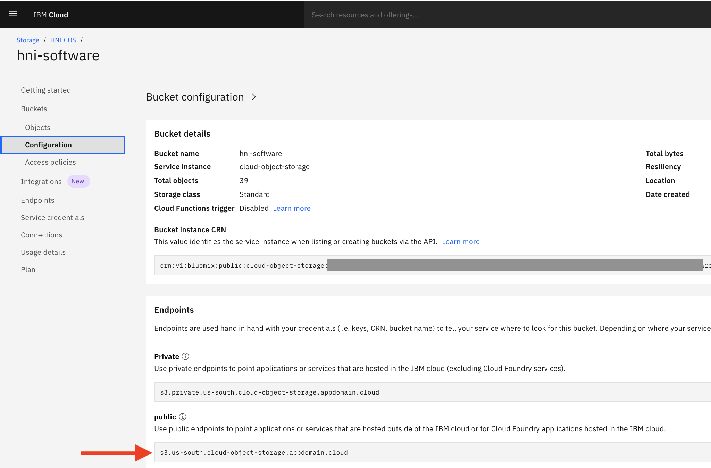

# Use curl to download files from IBM Cloud Object Storage

This technote explains how you can use curl to download files from a secured IBM Cloud Object Storage bucket.

## Generating a temporary bearer token
To get secure access to IBM via curl we need to send an authorization bearer token in the header of our download request. The bearer token can only be used for a limited time, so we will need to generate it each time we want to download stuff. To generate a bearer token we will need an IBM Cloud apikey first. We will use the apikey to generate the temporary bearer token.

### Get an IBM Cloud API key

Goto https://cloud.ibm.com/iam/apikeys and create a new API key. This API key is only shown once. It can be used to get access to your IBM Cloud stuff via REST APIs, so copy it somewhere SAFE!

### Generate the bbearer token
With the API key you can generate the necessary bearer token. Replace {{your-apikey}} with your apikey.

```
curl -X "POST" "https://iam.cloud.ibm.com/oidc/token" \
     -H 'Accept: application/json' \
     -H 'Content-Type: application/x-www-form-urlencoded' \
     --data-urlencode "apikey={{your-apikey}}" \
     --data-urlencode "response_type=cloud_iam" \
     --data-urlencode "grant_type=urn:ibm:params:oauth:grant-type:apikey"
```
## Get the download url for your COS Bucket/Object

Goto your COS bucket and




curl -H "Authorization"
